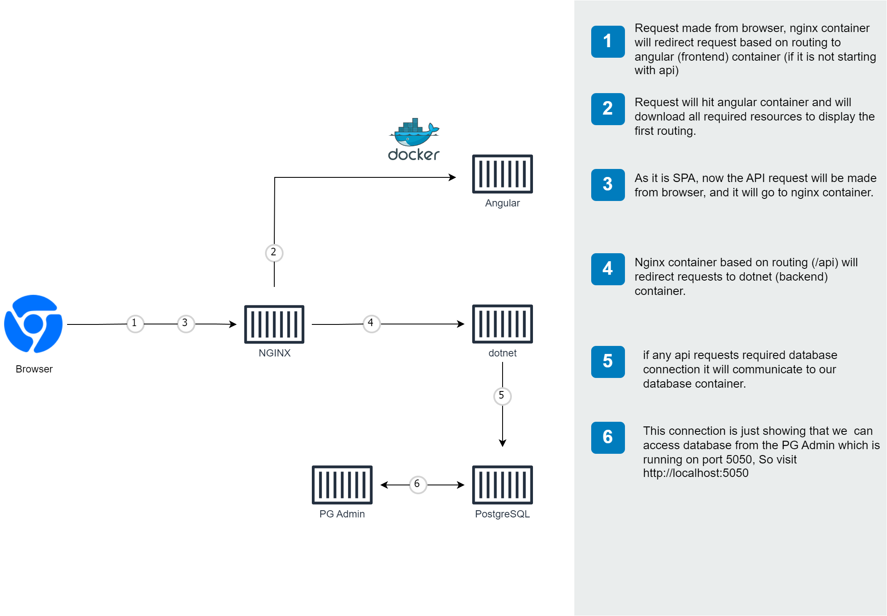

# Full Stack (dotnet, angular and postgres) boilerplate with Docker
### About (Dotnet - Angular - PostgresSQL)
This project is intended to provide a starting point for building full-stack web applicatioin. The stack is made of Dotnet(6) WebApi, Angular (14), PostgresSQL. The focus of this project to show case the possible way to run a real application (Dotnet, Angular and PostgresSQL) using docker for development enviornment and produciton mode.
## To Quick Run
Clone repo, navigate to root folder and run ` docker-compose -f 'docker-compose.yml' up`

```
  git clone https://github.com/nitin27may/angular-dotnet-core-docker.git angular-dotnet
  cd angular-dotnet 
  docker-compose -f 'docker-compose.yml' up
```

## About Project

This is a simple web application. It has working user registration, login page and there is a complete example of CRUD which contains example for Angular Routing and dotnet rest api samples. Also, rest services are secure using JWT. 

Below is the architecture of the application while it is running.



## Project Folders 
The apps written in the following JavaScript frameworks/libraries:

| folder          | Description                                                                                  |
| --------------- | -------------------------------------------------------------------------------------------- |
| **frontend** | [frontend app using **Angular**](https://github.com/nitin27may/angular-dotnet-core-docker/tree/master/frontend)         |
| **WebApi** | [Rest Api using **dotnet**](https://github.com/nitin27may/angular-dotnet-core-docker/tree/master/WebApi) |

### Built With
#### Angular (14.2.2)

In MEAN stack A stands for Angular, fronend of this project is developed in Angular.

It contains sample for below:

 1. User Registration
 2. Login
 3. Profile
 4. A complete CRUD example for Contact

Also, it has sample code for Auth guard, services, http interceptors, resolver and JWT implementation

For folder structure details refer this link: [Frontend Folder Structure] (/docs/angular-frontend-structure.md)

**[Dockerfile for Production](/frontend/Dockerfile)**
**[Dockerfile for Development](/frontend/debug.dockerfile)**

#### Dotnet (6.0.0)

In MEAN stack, E stands for Expressjs, all rest services are developed using express js.

It contains sample for:

1. Middleware implemetation for logs
2. JWT implementation for Authorization
3. API routing
4. User registration & login APIs
5. Complete CRUD example for Contact


**[Dockerfile for production](/Api/Dockerfile)**
**[Dockerfile for development](/Api/debug.dockerfile)**


## Getting started

### Using Docker

#### Prerequisite
Install latest [Docker Desktop](https://www.docker.com/products/docker-desktop)


#### Entity Framework Migration
We have added a dockerfile for entity framework migration and updating database. 

**[Dockerfile for Migration](/Api/Migration.Dockerfile)**


#### Development mode:
  You can start the application in debug mode (database, api and frontend) using docker-compose:

  ```
   git clone https://github.com/nitin27may/angular-dotnet-core-docker.git angular-dotnet
  cd angular-dotnet 
  
  docker-compose -f 'docker-compose.debug.yml' up
  ```

  It will run fronend `http://localhost:4200` and api on `http://localhost:8080`. you can also access PGAdmin  on port 80 with username pssword provided in docker-compose, username: nitin27may@gmail.com, password: root.

  Also, it will automatically refresh (hot reload) your UI for code and api code changes.
